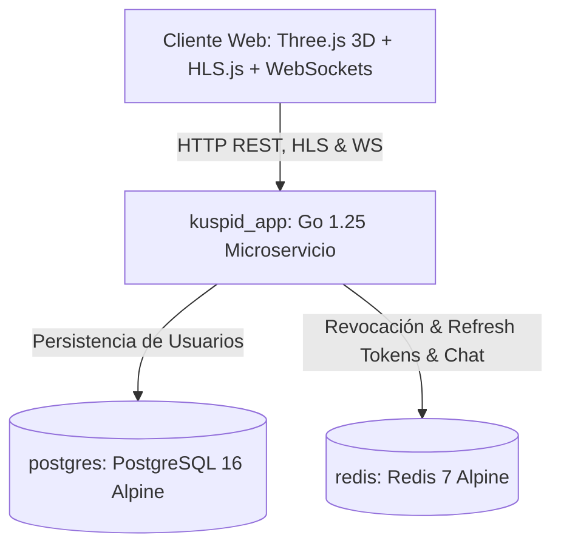
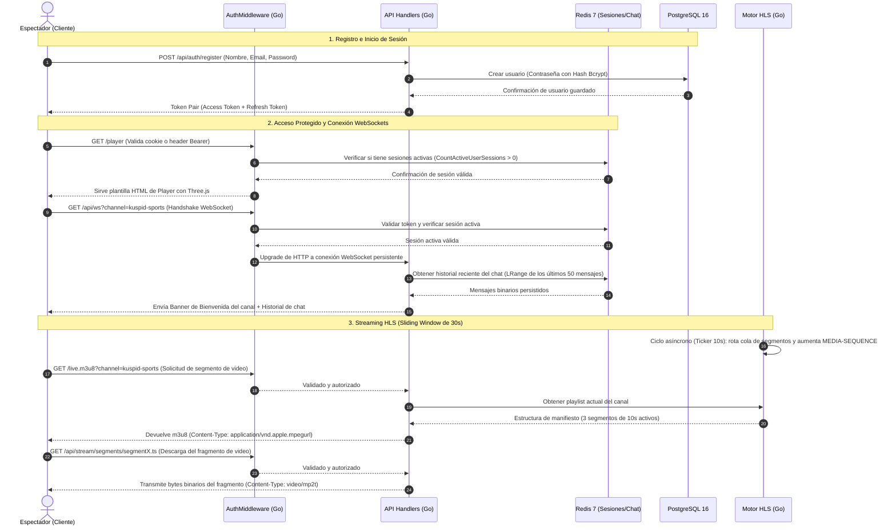
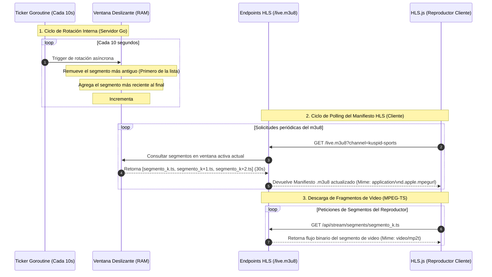

# ⚡ Kuspid HLS Live Streaming Service (Go + PostgreSQL + Redis + Three.js 3D)

¡Bienvenido al repositorio de **Kuspid HLS Live Streaming** en **Go (Golang)**!

> 🌐 **Despliegue en Vivo (Producción GCP):** El aplicativo se encuentra desplegado y funcionando de forma segura en **[https://test.lsignach.cl/player](https://test.lsignach.cl/player)**.

Esta plataforma entrega una solución de nivel productivo para la transmisión de **HLS Live Streaming dinámico con Sliding Window (30 segundos)**, autenticación segura con **Patrón de Doble Token (JWT + Redis 7)**, base de datos **PostgreSQL 16**, caché de revocación y almacenamiento rápido de chat en **Redis 7**, servidor de **WebSockets en tiempo real por canal**, **Hardening de Seguridad** y un **Frontend 3D Cinematográfico** desarrollado con **Three.js y WebGL**.

---

## 📸 Demostración de las 3 Vistas Principales

1. **Crear Cuenta (`/register`)**: Formulario 3D Glassmorphic con fondo espacial dinámico de la Cordillera de los Andes en 3D y efecto parallax interactivo.
2. **Iniciar Sesión (`/login`)**: Autenticación segura con generación y almacenamiento de Token Pair (Access Token + Refresh Token de 30 días persistido y verificado en Redis).
3. **Reproductor HLS & Telemetría (`/player`)**:
   - Reproductor **Custom Propietario** con overlay en fade, controles de audio y logo iluminado **`⚡ KUSPID HLS`** en estados de pausa/reproducción.
   - **Menú Lateral Izquierdo 3D (Kuspid Drawer)** con animación en perspectiva 3D (`rotateY`) y selección de canales independientes.
   - Canal por Defecto y Canales Adicionales:
     - `kuspid-sports` (Deportes)
     - `kuspid-cinema` (Cine)
     - `kuspid-tech` (Tecnología y Gaming)
   - **HUD de Telemetría Go en Vivo**: Uso de memoria RAM en tiempo real (`runtime.MemStats`), Goroutines activas, secuencia `#EXT-X-MEDIA-SEQUENCE`, estado del búfer del video y conexiones WebSockets activas.
   - **Chat en Vivo & Reacciones en Ráfaga (WebSockets)**: Los mensajes y reacciones emojis fluyen en tiempo real en espacio de coordenadas WebGL sobre la pantalla. Incluye interruptor de visibilidad `✨ ON / OFF` con persistencia en `localStorage`.

---

## 🛠️ Arquitectura e Hitos Técnicos (Senior Backend in Go)



### Diagrama de Secuencia: Ciclo de Vida y Flujo del Sistema

Este diagrama ilustra la secuencia cronológica de interacción entre el cliente (Navegador), los middlewares de seguridad, la persistencia en PostgreSQL, la sesión y chat en Redis, y el motor HLS asíncrono en Go:



### Diagrama de Secuencia: Mecanismo de la Ventana Deslizante (Sliding Window)

Este diagrama detalla cómo interactúa de forma asíncrona la rotación en memoria del servidor Go con las peticiones periódicas de manifiestos y fragmentos del reproductor HLS:



### 1. Engine HLS Live Streaming (Sliding Window 30s)
- **Sliding Window de 30 Segundos**: La lista de reproducción `.m3u8` mantiene estrictamente **3 segmentos activos de 10 segundos** cada uno.
- **Ticker Goroutine (10s)**: Cada 10 segundos se retira el segmento más antiguo de la cola y se agrega uno nuevo al final de la ventana de forma concurrente y segura mediante bloqueos de lectura/escritura (`sync.RWMutex`).
- **Incremento Secuencial `#EXT-X-MEDIA-SEQUENCE`**: La etiqueta del manifiesto incrementa secuencialmente en `+1` con cada rotación de segmento.
- **Rendimiento RAM Cero-Copia**: Implementado mediante `http.ServeContent` y reutilización de búferes con `sync.Pool`.

### 2. Patrón de Doble Token (Dual-Token) & Revocación en Redis
- **Access Token (15m)**: JWT de corta duración firmado digitalmente con HMAC-SHA256 para validaciones rápidas.
- **Refresh Token (30d)**: Token de larga duración registrado y verificado en **Redis 7**.
- **Rotación Transparente Deslizante**: Si el Access Token expira mientras el usuario ve el reproductor, el middleware detecta el Refresh Token en Redis, genera un nuevo Access Token al vuelo, y lo adjunta en la cabecera `X-New-Token` de la respuesta, el cual es guardado automáticamente por el cliente sin interrumpir la señal HLS.
- **Revocación Inmediata / Logout**: Al cerrar sesión o hacer click en "Forzar salida de otros dispositivos", los tokens son eliminados inmediatamente de Redis.

### 3. Hardening de Seguridad
- **Security Headers Middleware**: `X-Content-Type-Options: nosniff`, `X-Frame-Options: DENY`, `X-XSS-Protection: 1; mode=block`, `Content-Security-Policy (CSP)`.
- **IP Rate Limiter**: Algoritmo Token-Bucket por IP contra ataques de fuerza bruta en `/api/auth/login` y `/api/auth/register` (HTTP 429).
- **PostgreSQL 16**: Consultas parametrizadas seguras contra inyección SQL.

---

## 🚀 Cómo Ejecutar la Aplicación

### Requisitos Previos
Tener instalado [Docker Desktop](https://www.docker.com/products/docker-desktop/).

### Ejecución Directa (Docker Compose)
Para levantar el microservicio de Go, la base de datos PostgreSQL 16 y el caché Redis 7:

```pwsh
docker compose up --build -d
```

> [!IMPORTANT]
> **Integración con tu Caddy Server en Producción (Host/VM):**
> Dado que tu máquina virtual ya tiene un contenedor Caddy principal (`lsignach-caddy-1`) sirviendo en los puertos `80`/`443`, el archivo `docker-compose.yml` de este proyecto se configuró para exponer el puerto `8080` de forma interna en `127.0.0.1:8080` (localhost) por motivos de seguridad.
>
> Para habilitar la señal bajo el dominio `test.lsignach.cl`, debes copiar el bloque de configuración del archivo **[Caddyfile](file:///c:/Users/aleje/Documents/gh/test_zapping/Caddyfile)** provisto en la raíz de este proyecto e integrarlo dentro del **Caddyfile principal de tu VM**.
>
> **Configuración a añadir en el Caddyfile del Host:**
> ```text
> test.lsignach.cl {
>     reverse_proxy localhost:8080
> }
> ```
> Tras guardarlo, recarga la configuración del Caddy principal de tu host (`caddy reload` o reiniciando el contenedor `lsignach-caddy-1`).

### Rutas del Aplicativo

#### En Producción (GCP con Caddy SSL HTTPS):
* **Página de Registro**: [https://test.lsignach.cl/register](https://test.lsignach.cl/register)
* **Página de Login**: [https://test.lsignach.cl/login](https://test.lsignach.cl/login)
* **Página del Player**: [https://test.lsignach.cl/player](https://test.lsignach.cl/player)
* **Documentación de la API**: [https://test.lsignach.cl/swagger.html](https://test.lsignach.cl/swagger.html)

#### En Desarrollo Local:
* Si estás probando de forma local, puedes cambiar el mapeo en `docker-compose.yml` de `127.0.0.1:8080:8080` a `8080:8080` para acceder desde cualquier interfaz de red a [http://localhost:8080/player](http://localhost:8080/player).


---

## 🧪 Ejecución de Pruebas Unitarias e Integración

El proyecto cuenta con **30 pruebas unitarias y de integración** automatizadas que validan el comportamiento del motor HLS, el algoritmo de rotación del sliding window, la seguridad del token JWT, la lógica de rate limiting y la respuesta de los controladores HTTP.

Para correr las pruebas:

```bash
go test -buildvcs=false -v ./...
```

### Cobertura de las Pruebas:
- **`internal/auth`**: Validaciones de expiración de tokens, firmas JWT alteradas, unicidad del JTI y hashes de contraseñas con bcrypt.
- **`internal/middleware`**: Controladores de cabeceras de seguridad y límites de tasa IP (Rate Limiter).
- **`internal/hls`**: Tickers de ventana deslizante, consistencia del manifiesto `.m3u8` y consistencia del índice sequence.
- **`internal/handler`**: Pruebas de simulación HTTP (`httptest`) para registrar cuentas, iniciar sesión con contraseñas correctas e incorrectas, servir segmentos `.ts` con su tipo mime correcto (`video/mp2t`) y validar que la playlist de streaming tenga exactamente 3 segmentos (30 segundos de video).

---

## 📬 Colección de Postman (API Testing)

Se ha adjuntado el archivo de colección de Postman **[kuspid_hls.postman_collection.json](file:///c:/Users/aleje/Documents/gh/test_zapping/kuspid_hls.postman_collection.json)** en la raíz del proyecto para importar y probar de forma interactiva todos los endpoints de la API (Autenticación, Streaming HLS, Sesiones activas y Telemetría en vivo).

### Pasos para usar:
1. Importa el archivo `kuspid_hls.postman_collection.json` en tu cliente de Postman.
2. Inicia el servidor mediante `docker compose up --build`.
3. Ejecuta la petición `Registrar Usuario` o `Iniciar Sesión (Login)`. El script de pruebas de Postman guardará automáticamente los tokens (`kuspid_access_token` y `kuspid_refresh_token`) en tus variables globales.
4. Ejecuta las llamadas protegidas (`Obtener Información del Usuario`, `Obtener Playlist de Canal en Vivo`, etc.) de forma transparente.

---

## 📁 Estructura del Proyecto

```text
├── cmd/
│   └── server/
│       └── main.go         # Punto de entrada de la aplicación Go
├── internal/
│   ├── auth/               # Firma y validación de tokens JWT
│   ├── cache/              # Cliente y caché en Redis 7 (con fallback in-memory)
│   ├── db/                 # Conexión a base de datos PostgreSQL 16
│   ├── handler/            # Controladores HTTP de la API REST e HLS
│   ├── hls/                # Motor de transmisión HLS (Sliding Window de 30s)
│   ├── middleware/         # Middleware de seguridad, rate limit y autenticación
│   └── ws/                 # Servidor WebSockets por canal
├── media/
│   └── segments/           # Segmentos de video provistos (.ts)
├── specs/                  # Documentación de requerimientos y arquitectura
├── web/
│   ├── static/             # Recursos estáticos (CSS, JS, imágenes, SVG favicon)
│   ├── login.html          # Vista de Login
│   ├── register.html       # Vista de Registro
│   ├── player.html         # Vista del Player interactivo 3D
│   ├── swagger.html        # Swagger UI
│   └── swagger.json        # Especificación OpenAPI 3.0.3
├── Caddyfile              # Configuración de Caddy Server para SSL HTTPS automático
├── Dockerfile              # Dockerfile multi-stage optimizado
└── docker-compose.yml      # Configuración de orquestación de servicios
```
